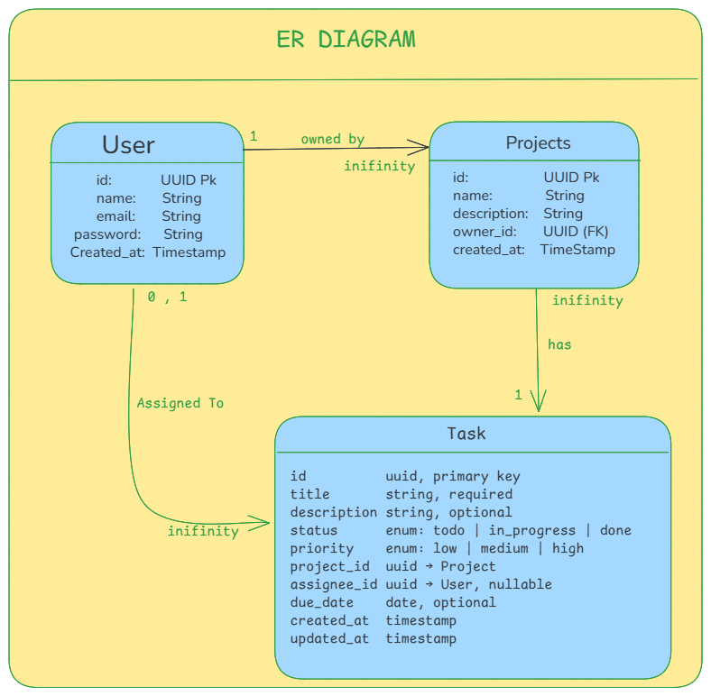

#  TaskFlow
**A robust Go-based Task Management Backend.**

TaskFlow is a production-ready REST API built with the Gin framework, focusing on project organization, task tracking, and secure JWT-based authentication.

---

##  Tech Stack
* **Language:** [Go](https://go.dev/) (Gin Framework)
* **Database:** [PostgreSQL](https://www.postgresql.org/) with [GORM](https://gorm.io/)
* **Migrations:** [golang-migrate](https://github.com/golang-migrate/migrate)
* **DevOps:** Docker & Docker Compose
* **Auth:** JWT (JSON Web Tokens)

---

## Architecture Decisions
* **Versioned Migrations:** We avoid `AutoMigrate` to maintain strict schema control and prevent unexpected production changes.
* **Decoupled Migration Service:** A dedicated container ensures the database schema is fully ready before the API attempts to connect.
* **Dockerized Environment:** Ensures "it works on my machine" consistency across all development environments.

---

##  Getting Started

### Prerequisites
* Docker Desktop installed.

### Installation & Run
1. **Clone the repository**
   ```bash
   git clone https://github.com/madan-kumar-tm/taskflow-madan-kumar-tm.git
   cd taskflow-madan-kumar-tm
   ```
2. **Setup Environment**
   ```bash
   cp .env.example .env
   ```
3. **Spin up containers**
   ```bash
   docker compose up --build
   ```
The API will be live at `http://localhost:8080`.

---

## ER Diagram
  

##  Authentication
**Default Test User:**
* **Email:** `test@example.com`
* **Password:** `password123`

| Method | Endpoint | Description |
| :--- | :--- | :--- |
| `POST` | `/auth/register` | Create a new account |
| `POST` | `/auth/login` | Receive JWT access token |

---

##  API Reference

### Projects
| Method | Endpoint | Description |
| :--- | :--- | :--- |
| `GET` | `/projects` | List all projects |
| `POST` | `/projects` | Create a new project |
| `GET` | `/projects/:id` | Get project details & tasks |
| `PATCH` | `/projects/:id` | Update project info |
| `DELETE` | `/projects/:id` | Remove project |

### Tasks
| Method | Endpoint | Description |
| :--- | :--- | :--- |
| `GET` | `/projects/:id/tasks` | List tasks (Supports `status` & `assignee` filters) |
| `POST` | `/projects/:id/tasks` | Create task within a project |
| `PATCH` | `/tasks/:id` | Update task status or details |
| `DELETE` | `/tasks/:id` | Remove task |

---

## 🛠 Development Notes

### Database Migrations
Migrations run automatically on startup. To check migration status:
```bash
docker logs taskflow-migrate
```

### Future Roadmap
* [ ] Pagination for project and task lists.
* [ ] Comprehensive Integration Test Suite.
* [ ] CI/CD Pipeline integration.
* [ ] Structured logging with Request/Trace IDs.

---

**Author:** [Madan Kumar T M](https://github.com/madan-kumar-tm)